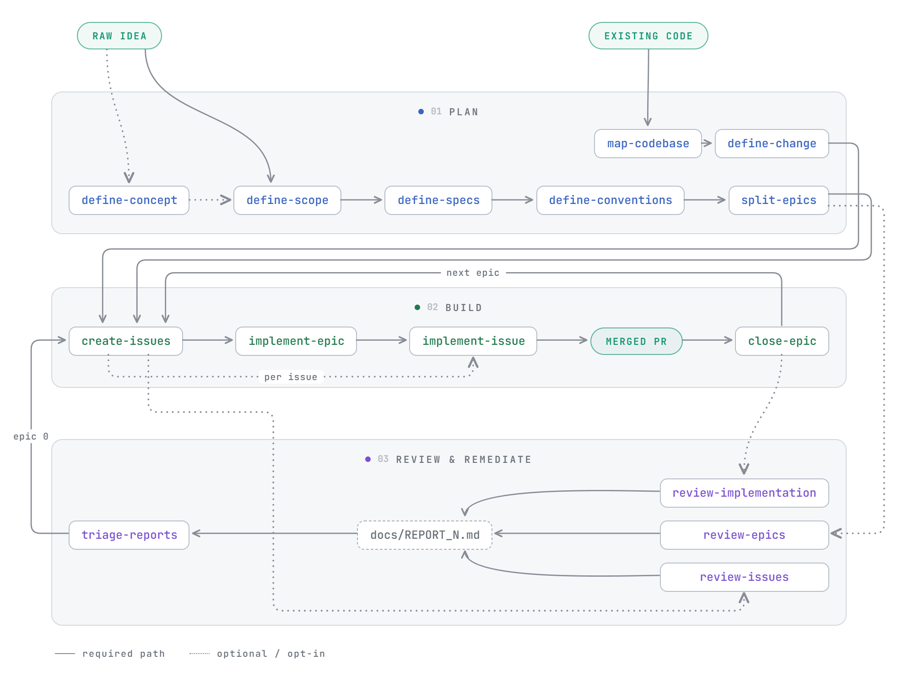
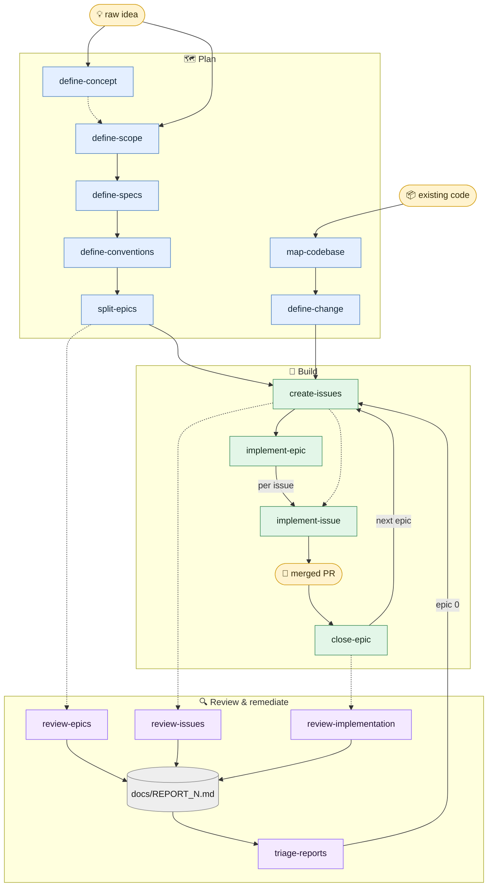

**Claude Code skills for taking a project from raw idea to merged PR** — greenfield or brownfield — plus documentation tooling and a self-improvement loop.

This repo is a [Claude Code plugin marketplace](https://code.claude.com/docs/en/plugin-marketplaces). One command installs everything:

```
/plugin marketplace add julienlegoux/skills
/plugin install lx@lx-engine
```

Skills are then namespaced: `/lx:define-scope`, `/lx:okf-docs`.

---

## 🗺️ The planning-to-PR pipeline

The core of this repo is a chain of skills that carries work all the way to reviewable pull requests. Each skill's output is the next skill's input. There are two entry points — a new project, or an existing codebase — and they converge on the same epic → issue → PR machinery, which then *loops*: an epic closes, its review reports become the next epic.

<picture>
  <source media="(prefers-color-scheme: dark)" srcset="assets/pipeline-dark.png">
  <source media="(prefers-color-scheme: light)" srcset="assets/pipeline-light.png">
  
</picture>

Solid arrows are the path work takes; dotted ones are optional entries and hand-offs (`implement-issue` runs standalone too, and every review skill is opt-in).

<details>
<summary>Diagram source (Mermaid)</summary>



</details>

### 🌱 Greenfield — plan a new project

| Stage | Skill | What it does |
|---|---|---|
| 0️⃣ | [`define-concept`](skills/define-concept/SKILL.md) | *Optional.* Talk a still-forming idea into shape and record what *you* validate into `CONCEPT.md` — no ledger, no checklist |
| 1️⃣ | [`define-scope`](skills/define-scope/SKILL.md) | Turn a raw idea into a decided `docs/planning/SCOPE.md` via a decision ledger *you* triage |
| 2️⃣ | [`define-specs`](skills/define-specs/SKILL.md) | Decide the one-way technical doors — stack, architecture, data, auth — into `SPECS.md` |
| 3️⃣ | [`define-conventions`](skills/define-conventions/SKILL.md) | Instantiate your personal conventions baseline; only *deviations* get decided |
| 4️⃣ | [`split-epics`](skills/split-epics/SKILL.md) | Cut the scope into epic folders, each with a GitHub milestone + tracking issue |

### 🏗️ Brownfield — change an existing app

| Stage | Skill | What it does |
|---|---|---|
| 1️⃣ | [`map-codebase`](skills/map-codebase/SKILL.md) | Reverse-engineer `SPECS.md` + `CONVENTIONS.md` by reading the code, not interviewing you |
| 2️⃣ | [`define-change`](skills/define-change/SKILL.md) | Audit one change's blast radius, decide *how it lands*, emit an `EPIC_N.md` `create-issues` consumes unchanged |

### 🔨 Build — both paths

| Skill | What it does |
|---|---|
| [`create-issues`](skills/create-issues/SKILL.md) | Turn one epic into right-sized GitHub sub-issues (~one 500-line PR each) |
| [`implement-issue`](skills/implement-issue/SKILL.md) | Take one issue from `open` to a focused, test-first PR — bookkeeping included |
| [`implement-epic`](skills/implement-epic/SKILL.md) | Supervise a whole epic: delegate each issue to `implement-issue`, watch CI, merge green PRs, repeat |
| [`close-epic`](skills/close-epic/SKILL.md) | Land the epic: verify its real state against GitHub and git, promote drift into `DRIFT.md`, close the milestone, clean up worktrees and branches |

### 🔍 Review companions

Audit skills that check the pipeline's output without modifying it:

| Skill | Reviews |
|---|---|
| [`review-epics`](skills/review-epics/SKILL.md) | Plan → epic conversion: epics, milestones, tracking issues vs. the source plan |
| [`review-issues`](skills/review-issues/SKILL.md) | Epic → issue conversion: sizing, coverage, sub-issue wiring |
| [`review-implementation`](skills/review-implementation/SKILL.md) | The code an epic actually shipped: its merged diff vs. the acceptance criteria, `CONVENTIONS.md` and the accepted drift |

All three write a prioritized `docs/REPORT_N.md` instead of silently "fixing" things — and that report is itself an input:

| Skill | What it does |
|---|---|
| [`triage-reports`](skills/triage-reports/SKILL.md) | Fold the accumulated `docs/REPORT_*.md` into one triaged remediation epic (`epic-0`) that `create-issues` consumes unchanged — which is what closes the loop |

## 📚 Knowledge tooling (OKF)

| Skill | What it does |
|---|---|
| [`okf-docs`](skills/okf-docs/SKILL.md) | Write & structurally validate docs in Google's **Open Knowledge Format** — markdown + YAML frontmatter bundles readable by humans and agents alike |
| [`okf-lint`](skills/okf-lint/SKILL.md) | Semantic linter for OKF bundles: contradictions, index drift, duplicate concepts, stale timestamps — everything a mechanical validator can't see |

## 🗣️ Feedback

| Skill | What it does |
|---|---|
| [`send-feedback`](skills/send-feedback/SKILL.md) | File what just went wrong as an issue on this repo — your words quoted verbatim, context offered rather than assumed, private paths redacted, nothing posted without your OK |

Ships **in** the plugin on purpose: it exists for people who don't have a clone to fix
things in. The repo is public with issues enabled, so any GitHub account can file one —
via `gh` if it's authenticated, otherwise a prefilled browser URL. No token is ever
bundled and none is needed.

## 🔁 Meta — *not shipped in the plugin*

These two author the repo itself: they need a clone, git, and push rights, so installing the plugin can't make them useful. They live in `meta/` and are installed by hand — fork the repo and junction them in:

```powershell
New-Item -ItemType Junction -Path "$HOME\.claude\skills\improve-skill" -Target "<repo>\meta\improve-skill"
```

| Skill | What it does |
|---|---|
| [`create-skill`](meta/create-skill/SKILL.md) | Add a skill to this repo — prove the need repeats, place it against the existing ones, draft it to the authoring contract |
| [`improve-skill`](meta/improve-skill/SKILL.md) | Fold lessons from the current session back into the skill that caused them: diagnose → propose → apply → commit |

---

## 📦 Repo layout

```
├── .claude-plugin/
│   ├── marketplace.json          ← marketplace "lx-engine"
│   └── plugin.json               ← plugin "lx" (bundles every skill below)
├── skills/                       ← the plugin: published, auto-discovered
│   ├── _shared/
│   │   ├── bundle-interfaces.md  ← rules for anything written under docs/
│   │   ├── ledger-interfaces.md  ← the decision doc, for ledger-driven skills
│   │   └── pipeline-interfaces.md ← epic/issue schemas, for epic-to-PR skills
│   ├── define-scope/SKILL.md
│   ├── define-specs/SKILL.md
│   └── ...one folder per skill
├── meta/                         ← outside the plugin, installed by hand
│   ├── _shared/authoring-interfaces.md
│   ├── create-skill/SKILL.md
│   └── improve-skill/SKILL.md
├── docs/                         ← documentation bundle
└── README.md
```

Every folder under `skills/` holds one skill (`SKILL.md` + supporting files) and is auto-discovered by the plugin. `_shared/` has no `SKILL.md`, so discovery skips it — and anything outside `skills/` is invisible to the plugin entirely, which is what keeps `meta/` local.

### Shared contracts

What the skills agree on lives in `skills/_shared/`, split by audience so no skill carries rules that don't apply to it:

| Interface | Defines | Audience |
|---|---|---|
| [`bundle-interfaces.md`](skills/_shared/bundle-interfaces.md) | English content, bundle & link rules, reserved `index.md`/`log.md`, committing what you write | every skill that writes under `docs/` |
| [`ledger-interfaces.md`](skills/_shared/ledger-interfaces.md) | the decision doc schema and reopening rule | the ledger-driven planning skills |
| [`pipeline-interfaces.md`](skills/_shared/pipeline-interfaces.md) | epic & issue schemas, status lifecycle, GitHub facts on integration branches | the epic-to-PR skills |
| [`authoring-interfaces.md`](meta/_shared/authoring-interfaces.md) | how a skill in this repo is shaped: description contract, progressive disclosure, tiered prescriptiveness | `create-skill`, `improve-skill` |

One file per contract, no generated copies, so an edit is live everywhere at once. The three under `skills/_shared/` are read as `../_shared/<file>` and ship with the plugin; the trade is that a published skill folder is not portable on its own — the repo is the unit. The fourth is read as `<repo>/meta/_shared/<file>`, because its two consumers are installed away from the repo and resolve it first anyway.

## 🛠️ Developing

There is no install step. Point your skills directory at the clone once — the plugin at the repo root, then each `meta/` skill on its own — and the file you edit is the file Claude Code runs:

```powershell
New-Item -ItemType Junction -Path "$HOME\.claude\skills\lx-engine"     -Target "<repo>"
New-Item -ItemType Junction -Path "$HOME\.claude\skills\create-skill"  -Target "<repo>\meta\create-skill"
New-Item -ItemType Junction -Path "$HOME\.claude\skills\improve-skill" -Target "<repo>\meta\improve-skill"
```

Then, after editing: `/reload-plugins` in the session, and

```
claude plugin validate .
claude plugin details lx@skills-dir    # confirms what was actually discovered
```

Or let [`improve-skill`](meta/improve-skill/SKILL.md) run the loop — it diagnoses, edits and commits in one pass.

## 📄 License

Personal toolkit — use freely, adapt liberally.
