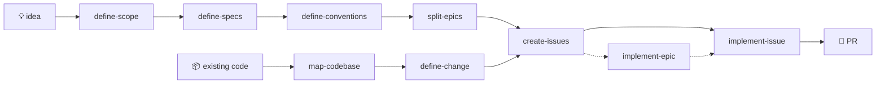

**Claude Code skills for taking a project from raw idea to merged PR** — greenfield or brownfield — plus documentation tooling and a self-improvement loop.

This repo is a [Claude Code plugin marketplace](https://code.claude.com/docs/en/plugin-marketplaces). One command installs everything:

```
/plugin marketplace add julienlegoux/skills
/plugin install skills@lx-engine
```

---

## 🗺️ The planning-to-PR pipeline

The core of this repo is a chain of skills that carries work all the way to reviewable pull requests. Each skill's output is the next skill's input. There are two entry points — a new project, or an existing codebase — and they converge on the same epic → issue → PR machinery:



### 🌱 Greenfield — plan a new project

| Stage | Skill | What it does |
|---|---|---|
| 1️⃣ | [`define-scope`](define-scope/SKILL.md) | Turn a raw idea into a decided `docs/planning/SCOPE.md` via a decision ledger *you* triage |
| 2️⃣ | [`define-specs`](define-specs/SKILL.md) | Decide the one-way technical doors — stack, architecture, data, auth — into `SPECS.md` |
| 3️⃣ | [`define-conventions`](define-conventions/SKILL.md) | Instantiate your personal conventions baseline; only *deviations* get decided |
| 4️⃣ | [`split-epics`](split-epics/SKILL.md) | Cut the scope into epic folders, each with a GitHub milestone + tracking issue |

### 🏗️ Brownfield — change an existing app

| Stage | Skill | What it does |
|---|---|---|
| 1️⃣ | [`map-codebase`](map-codebase/SKILL.md) | Reverse-engineer `SPECS.md` + `CONVENTIONS.md` by reading the code, not interviewing you |
| 2️⃣ | [`define-change`](define-change/SKILL.md) | Audit one change's blast radius, decide *how it lands*, emit an `EPIC_N.md` `create-issues` consumes unchanged |

### 🔨 Build — both paths

| Skill | What it does |
|---|---|
| [`create-issues`](create-issues/SKILL.md) | Turn one epic into right-sized GitHub sub-issues (~one 500-line PR each) |
| [`implement-issue`](implement-issue/SKILL.md) | Take one issue from `open` to a focused, test-first PR — bookkeeping included |
| [`implement-epic`](implement-epic/SKILL.md) | Supervise a whole epic: delegate each issue to `implement-issue`, watch CI, merge green PRs, repeat |

### 🔍 Review companions

Audit skills that check the pipeline's output without modifying it:

| Skill | Reviews |
|---|---|
| [`review-epics`](review-epics/SKILL.md) | Plan → epic conversion: epics, milestones, tracking issues vs. the source plan |
| [`review-issues`](review-issues/SKILL.md) | Epic → issue conversion: sizing, coverage, sub-issue wiring |

Both write a prioritized `docs/REPORT_N.md` instead of silently "fixing" things.

## 📚 Knowledge tooling (OKF)

| Skill | What it does |
|---|---|
| [`okf-docs`](okf-docs/SKILL.md) | Write & structurally validate docs in Google's **Open Knowledge Format** — markdown + YAML frontmatter bundles readable by humans and agents alike |
| [`okf-lint`](okf-lint/SKILL.md) | Semantic linter for OKF bundles: contradictions, index drift, duplicate concepts, stale timestamps — everything a mechanical validator can't see |

## 🔁 Meta

| Skill | What it does |
|---|---|
| [`improve-skill`](improve-skill/SKILL.md) | Fold lessons from the current session back into the skill that caused them: diagnose → propose → apply → commit → reinstall |

---

## 📦 Repo layout

```
skills/
├── .claude-plugin/
│   ├── marketplace.json          ← marketplace "lx-engine"
│   └── plugin.json               ← plugin "skills" (bundles every skill below)
├── _shared/
│   ├── pipeline-interfaces.md    ← single source of truth for pipeline formats
│   └── sync.ps1                  ← copies it into each pipeline skill's references/
├── docs/                         ← this repo's own OKF bundle (backlog, retros, plans)
├── define-scope/SKILL.md
├── define-specs/SKILL.md
├── ...one folder per skill
```

Every top-level folder holds one skill (`SKILL.md` + supporting files) and is auto-discovered by the plugin.

### Shared pipeline contract

The file formats, status lifecycles, link rules, and GitHub facts shared by the pipeline skills live once in [`_shared/pipeline-interfaces.md`](_shared/pipeline-interfaces.md). Each pipeline skill (`split-epics`, `define-change`, `create-issues`, `implement-issue`, `implement-epic`) ships a synced copy under its `references/` so it stays self-contained. **Never edit a synced copy** — edit the shared file and re-run `_shared/sync.ps1`.

## 🛠️ Developing

Skills are developed here, then installed. After editing a skill:

```
claude plugin validate .
```

After editing `_shared/pipeline-interfaces.md`:

```
pwsh _shared/sync.ps1
```

Or let [`improve-skill`](improve-skill/SKILL.md) run the whole loop — it edits, syncs, commits, and reinstalls in one pass.

## 📄 License

Personal toolkit — use freely, adapt liberally.
