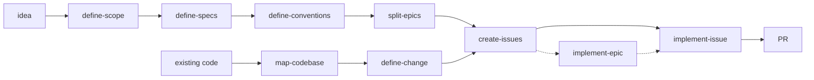

# The idea-to-PR pipeline

The core of the repo is a chain where **each skill's output is the next skill's
input**. Two entry points — a new project, or an existing codebase — converge on the
same epic → issue → PR machinery.

# Greenfield — plan a new project

| # | Skill | Produces |
|---|---|---|
| 1 | `define-scope` | `docs/planning/SCOPE.md` — what v1 is |
| 2 | `define-specs` | `docs/planning/SPECS.md` — the one-way doors: stack, architecture, data, auth, deployment |
| 3 | `define-conventions` | `docs/planning/CONVENTIONS.md` — a personal baseline filtered by the stack; only *deviations* get decided |
| 4 | `split-epics` | `docs/epics/epic-<n>-<slug>/EPIC_<n>.md` + a GitHub milestone and tracking issue per epic |

# Brownfield — change an existing app

| # | Skill | Produces |
|---|---|---|
| 1 | `map-codebase` | `SPECS.md` + `CONVENTIONS.md` reverse-engineered by reading the code, not by interviewing the user |
| 2 | `define-change` | One change's blast radius, decided; emits an `EPIC_N.md` that `create-issues` consumes unchanged |

`split-epics` and `define-change` produce **format-identical** epic files on purpose —
downstream skills cannot tell which entry point made them.

# Build — both paths

| Skill | Does |
|---|---|
| `create-issues` | Cuts one epic into right-sized GitHub sub-issues (~one 500-line PR each) |
| `implement-issue` | Takes one issue from `open` to a focused, test-first PR, bookkeeping included |
| `implement-epic` | Supervises a whole epic: delegates each issue to `implement-issue`, watches CI, merges green PRs, repeats |

# Review companions

`review-epics` (plan → epic conversion) and `review-issues` (epic → issue conversion)
audit the pipeline's output and write a prioritized `docs/REPORT_N.md`. They
deliberately **do not fix** what they find — a reviewer that silently edits its
subject destroys the evidence.

# The decision ledger

The four planning skills (`define-scope`, `define-specs`, `define-conventions`,
`define-change`, plus `map-codebase`) share one mechanic: instead of asking open
questions in chat, they write **one file per decision** — question, 2–4 options, a
real recommendation — and let the user triage them in batch. The schema lives in
[Shared interfaces](/shared-interfaces.md).

# What the hand-offs rely on

Every arrow in the diagram is a file contract, not a conversation:

* Epic and issue **schemas + status lifecycle** — `../_shared/pipeline-interfaces.md`
* Where docs land, how they link, what gets committed — `../_shared/bundle-interfaces.md`
* The decision doc — `../_shared/ledger-interfaces.md`

Which is why those three files are single-sourced rather than restated in each
`SKILL.md`. See [Shared interfaces](/shared-interfaces.md).

# Citations

* `README.md`
* Each skill's `SKILL.md` frontmatter description
