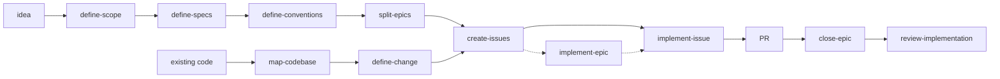

# The idea-to-PR pipeline

The core of the repo is a chain where **each skill's output is the next skill's
input**. Two entry points — a new project, or an existing codebase — converge on the
same epic → issue → PR machinery.

# Greenfield — plan a new project

| # | Skill | Produces |
|---|---|---|
| 1 | `define-scope` | `docs/planning/SCOPE.md` — what v1 is |
| 2 | `define-specs` | `docs/planning/SPECS.md` — the one-way doors: stack, architecture, data, auth, deployment |
| 3 | `define-conventions` | `docs/planning/CONVENTIONS.md` — a personal baseline filtered by the stack; only *deviations* get decided |
| 4 | `split-epics` | `docs/epics/epic-<n>-<slug>/EPIC_<n>.md` + a GitHub milestone and tracking issue per epic |

# Brownfield — change an existing app

| # | Skill | Produces |
|---|---|---|
| 1 | `map-codebase` | `SPECS.md` + `CONVENTIONS.md` reverse-engineered by reading the code, not by interviewing the user |
| 2 | `define-change` | One change's blast radius, decided; emits an `EPIC_N.md` that `create-issues` consumes unchanged |

`split-epics` and `define-change` produce **format-identical** epic files on purpose —
downstream skills cannot tell which entry point made them.

# Build — both paths

| Skill | Does |
|---|---|
| `create-issues` | Cuts one epic into right-sized GitHub sub-issues (~one 500-line PR each) |
| `implement-issue` | Takes one issue from `open` to a focused, test-first PR, bookkeeping included |
| `implement-epic` | Supervises a whole epic: delegates each issue to `implement-issue`, watches CI, merges green PRs, repeats |
| `close-epic` | Closes out a stopped run: verifies the epic's real state against GitHub and git, promotes the drift its implementers recorded, closes the milestone, removes worktrees and merged branches |

A stopped `implement-epic` loop is not a closed epic — the worktrees are still on disk,
the merged branches still on the remote, the milestone still open, and what the
implementers learned still sitting in a chat report that dies with the session. That
seam is `close-epic`'s whole job.

# Review companions

Three audit skills read a different stage's output each:

| Skill | Reviews |
|---|---|
| `review-epics` | plan → epic conversion: epics, milestones, tracking issues against the source plan |
| `review-issues` | epic → issue conversion: sizing, coverage, sub-issue wiring |
| `review-implementation` | the code the epic actually shipped — its merged diff against the acceptance criteria, `CONVENTIONS.md`, and the accepted drift |

All three write a prioritized `docs/REPORT_N.md` and none repairs its subject — a
reviewer that silently edits what it reviews destroys the evidence. `review-implementation`
routes what it finds into follow-up issues or drift entries instead of touching the code.

Why the third one exists: every PR in an epic was reviewed alone and passed alone. The
duplication between issue 3 and issue 7, the abstraction four implementers each
re-invented because none could see the others, the convention that eroded a little per
PR — none of that is visible from inside a single PR, and all of it is merged by the
time anyone could look.

# The decision ledger

The four planning skills (`define-scope`, `define-specs`, `define-conventions`,
`define-change`, plus `map-codebase`) share one mechanic: instead of asking open
questions in chat, they write **one file per decision** — question, 2–4 options, a
real recommendation — and let the user triage them in batch. The schema lives in
[Shared interfaces](/shared-interfaces.md).

# What the hand-offs rely on

Every arrow in the diagram is a file contract, not a conversation:

* Epic and issue **schemas + status lifecycle** — `../_shared/pipeline-interfaces.md`
* The **drift register** — `../_shared/pipeline-interfaces.md`
* Where docs land, how they link, what gets committed — `../_shared/bundle-interfaces.md`
* The decision doc — `../_shared/ledger-interfaces.md`

Which is why those three files are single-sourced rather than restated in each
`SKILL.md`. See [Shared interfaces](/shared-interfaces.md).

# The drift register — the one contract that flows backwards

Every other arrow points forward: a plan becomes epics, epics become issues, issues
become PRs. **Drift** flows the other way. It is the code diverging from a standard the
project already decided, and implementation is the only stage that can discover it — a
pinned version the ecosystem can't satisfy, a mandated library that breaks the build.

It travels through two artifacts with two different jobs:

| Artifact | Written by | Job |
|---|---|---|
| `docs/epics/epic-<n>-<slug>/drift/<nn>-<slug>.md` | `implement-issue`, during the run | **evidence** — what was decided, the verified blocker, the alternatives, the revisit trigger |
| `docs/planning/DRIFT.md` | `close-epic`, once at epic close | the **register** every later run reads |

The records can't be the reader surface: they're written concurrently by implementers
blind to each other, scattered one folder per epic, and nothing tells a later reader
which epics to sweep. The register is single-writer, one path, and sits in
`docs/planning/` beside the `SPECS.md` and `CONVENTIONS.md` it contradicts — on the path
its readers already walk. `create-issues`, `implement-issue`, `implement-epic` and
`define-change` read it in the same breath as those two; `review-implementation` reads
it as an allowance, since drift that was accepted is not a finding.

Read only the decided standard and the next issue walks into the same wall — or a plan
gets written against a stack that no longer exists.

# Citations

* `README.md`
* Each skill's `SKILL.md` frontmatter description
