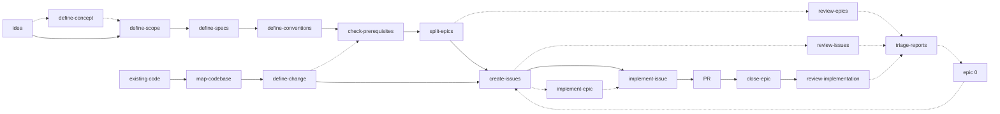

# The idea-to-PR pipeline

The core of the repo is a chain where **each skill's output is the next skill's
input**. Two entry points — a new project, or an existing codebase — converge on the
same epic → issue → PR machinery.

# Greenfield — plan a new project

| # | Skill | Produces |
|---|---|---|
| 0 | `define-concept` *(optional)* | `docs/planning/CONCEPT.md` — what the product *is*, and `DOMAIN.md` on request |
| 1 | `define-scope` | `docs/planning/SCOPE.md` — what v1 is |
| 2 | `define-specs` | `docs/planning/SPECS.md` — the one-way doors: stack, architecture, data, auth, deployment |
| 3 | `define-conventions` | `docs/planning/CONVENTIONS.md` — a personal baseline filtered by the stack; only *deviations* get decided |
| 4 | `check-prerequisites` | `docs/planning/PREREQUISITES.md` — what the plan depends on, probed; and the list of what only the user can supply |
| 5 | `split-epics` | `docs/epics/epic-<n>-<slug>/EPIC_<n>.md` + a GitHub milestone and tracking issue per epic |

Stage 0 is the odd one out and deliberately so. An idea still forming isn't a set of
decisions waiting to be triaged — it's a conversation — so `define-concept` has no
ledger, no checklist and no numbered steps; it records only what the user validates, and
`log.md` carries the rationale a ledger would have held. It is skipped whenever the idea
is already clear, which is why `define-scope` still works from a raw idea on its own.

The line it draws with `define-scope`: **CONCEPT answers "is this the right thing to
build?", SCOPE answers "what is its first version?"**. So `CONCEPT.md` never carries an
MVP cut or milestones — those belong to a document with the authority to decide them.

# Brownfield — change an existing app

| # | Skill | Produces |
|---|---|---|
| 1 | `map-codebase` | `SPECS.md` + `CONVENTIONS.md` reverse-engineered by reading the code, not by interviewing the user |
| 2 | `define-change` | One change's blast radius, decided; emits an `EPIC_N.md` that `create-issues` consumes unchanged |

`split-epics` and `define-change` produce **format-identical** epic files on purpose —
downstream skills cannot tell which entry point made them.

# Build — both paths

| Skill | Does |
|---|---|
| `create-issues` | Cuts one epic into right-sized GitHub sub-issues (~one 500-line PR each) |
| `implement-issue` | Takes one issue from `open` to a focused, test-first PR, bookkeeping included |
| `implement-epic` | Supervises a whole epic: delegates each issue to `implement-issue`, watches CI, merges green PRs, repeats |
| `close-epic` | Closes out a stopped run: verifies the epic's real state against GitHub and git, promotes the drift its implementers recorded, closes the milestone, removes worktrees and merged branches |

A stopped `implement-epic` loop is not a closed epic — the worktrees are still on disk,
the merged branches still on the remote, the milestone still open, and what the
implementers learned still sitting in a chat report that dies with the session. That
seam is `close-epic`'s whole job.

# Review companions

Three audit skills read a different stage's output each, and a fourth turns what they
find into work:

| Skill | Reviews |
|---|---|
| `review-epics` | plan → epic conversion: epics, milestones, tracking issues against the source plan |
| `review-issues` | epic → issue conversion: sizing, coverage, sub-issue wiring |
| `review-implementation` | the code the epic actually shipped — its merged diff against the acceptance criteria, `CONVENTIONS.md`, and the accepted drift |
| `triage-reports` | the reports themselves → one remediation epic |

All three reviewers write a prioritized report into `docs/reviews/`, named
`<YYYY-MM-DD>-<kind>-<subject>.md`, and none repairs its subject — a reviewer that
silently edits what it reviews destroys the evidence. The name is what replaced the flat
`docs/REPORT_<n>.md` series: the date sorts the directory, the kind and subject say what
was read, and no two reports can claim the same name, so nothing has to scan for the next
free integer. Reports written before the change stay at the root of `docs/` — that is
what keeps the epics linking into them valid — and `triage-reports` reads both layouts.

The two planning reviewers will hand their analysis pass to a model outside the Claude
family when one is reachable — `external-reviewer` on `PATH`, given a weight tier and an
explicit grant of the subtrees it may read, run against the repo through four read-only
tools — because a reviewer that did not write the thing catches what a self-review is
blind to. It is capability-detected: absent the tool, or with no reviewer configured on
the machine, the review runs natively and says nothing about it. The native pass is
unconditional either way. What comes back is treated as leads to verify, never as
findings to publish.

Why the third one exists: every PR in an epic was reviewed alone and passed alone. The
duplication between issue 3 and issue 7, the abstraction four implementers each
re-invented because none could see the others, the convention that eroded a little per
PR — none of that is visible from inside a single PR, and all of it is merged by the
time anyone could look.

# Epic 0 — the remediation lane

Not repairing is what keeps a report trustworthy, and it leaves a gap: findings pile up
in `docs/reviews/` with nothing that turns them into work. Nine reports carrying a
hundred findings is not something anyone acts on by hand.

`triage-reports` closes it. It reads the **whole series**, groups findings by the repair
that resolves them — one wrong link form in nine index files is one repair, not nine —
lets the user triage the groups in a single batch, and emits **epic 0**.

The number carries meaning the others don't. Every other epic number is a position in
the planned build order; zero means *before continuing*. That reads the same from either
direction the findings come from: plan repairs land before the epics they repair get
implemented, code fixes before the next epic builds on them. Which of the two a report
produces is read from its `## Scope`, never asked.

The lane is temporary. `triage-reports` creates epic 0 and extends it while it is in
flight rather than opening a second one; **`close-epic` retires it** — folder deleted —
once every issue is `done` and the milestone closed. Retirement sits with `close-epic`
because that is the skill running at the moment it becomes due: `triage-reports` is
invoked when reports pile up, not when an epic finishes implementing, so a lane waiting
on it lingers for a whole cycle.

What survives is the notice in `docs/epics/log.md`: which reports were consumed and what
they produced. That notice is also how the next run knows not to re-triage findings it
already fixed, which is why the folder can go and the memory cannot. Epic 0 is the only
epic that is *retired* rather than *closed* — every other one reaches `status: done` and
stays, because zero is a slot the next triage cycle needs back.

# The decision ledger

The four planning skills (`define-scope`, `define-specs`, `define-conventions`,
`define-change`, plus `map-codebase`) share one mechanic: instead of asking open
questions in chat, they write **one file per decision** — question, 2–4 options, a
real recommendation — and let the user triage them in batch, deep-diving one at a time
only on the items the user flags. Both the schema and those two passes are single-sourced
— see [Shared interfaces](/shared-interfaces.md). `define-concept` sits upstream of all of
them and shares none of it, for the reason given above.

# What the hand-offs rely on

Every arrow in the diagram is a file contract, not a conversation:

* Epic and issue **schemas + status lifecycle** — `../_shared/pipeline-interfaces.md`
* The **drift register** — `../_shared/pipeline-interfaces.md`
* Where docs land, how they link, what gets committed — `../_shared/bundle-interfaces.md`
* The decision doc, and the triage/deep-dive passes over a ledger — `../_shared/ledger-interfaces.md`

Which is why those three files are single-sourced rather than restated in each
`SKILL.md`. See [Shared interfaces](/shared-interfaces.md).

# The prerequisite gate — the check that runs before the build

Planning decides what the project will use; nothing in it confirms those things exist.
A stack, a test command, a hosted database and an API key all read the same on the page,
and three of them can be missing on the machine that will do the work.

`check-prerequisites` closes that gap at the one moment it is cheap: planning is final,
no epic has been cut, and nothing has been implemented against an assumption. It probes
what can be probed — running the real command, flags included, because a binary
answering `--version` proves the binary and not the capability — and sorts the rest into
the one list only the user can close: accounts, keys, CI secrets, quotas, permissions.
Both land in `docs/planning/PREREQUISITES.md`.

The register has one writer and three readers. `create-issues` and `implement-issue`
read it for context; **`implement-epic` gates on it**, stopping before it delegates a
single issue when an entry that epic needs is neither `ok` nor `waived`. That placement
is deliberate — it is the last point before compute gets spent, and it fails once, by
name, instead of inside an implementer's fifth tool call with a half-written branch to
clean up.

It sits on the greenfield path as a stage and hangs off `define-change` as an optional
one, because a brownfield change usually builds on what already runs — the exception
being a change that introduces a dependency the codebase never had.

Its `probed_on` field is what keeps it honest across machines: verifications are facts
about one machine, so a register carried elsewhere keeps its decisions and re-probes its
results. That distinction is also why a failed probe never becomes a project standard —
one laptop's blocked toolchain is not a rule for every future project.

# The drift register — the one contract that flows backwards

Every other arrow points forward: a plan becomes epics, epics become issues, issues
become PRs. **Drift** flows the other way. It is the code diverging from a standard the
project already decided, and implementation is the only stage that can discover it — a
pinned version the ecosystem can't satisfy, a mandated library that breaks the build.

It travels through two artifacts with two different jobs:

| Artifact | Written by | Job |
|---|---|---|
| `docs/epics/epic-<n>-<slug>/drift/<nn>-<slug>.md` | `implement-issue`, during the run | **evidence** — what was decided, the verified blocker, the alternatives, the revisit trigger |
| `docs/planning/DRIFT.md` | `close-epic`, once at epic close | the **register** every later run reads |

The records can't be the reader surface: they're written concurrently by implementers
blind to each other, scattered one folder per epic, and nothing tells a later reader
which epics to sweep. The register is single-writer, one path, and sits in
`docs/planning/` beside the `SPECS.md` and `CONVENTIONS.md` it contradicts — on the path
its readers already walk. `create-issues`, `implement-issue`, `implement-epic` and
`define-change` read it in the same breath as those two; `review-implementation` reads
it as an allowance, since drift that was accepted is not a finding.

Read only the decided standard and the next issue walks into the same wall — or a plan
gets written against a stack that no longer exists.

# Citations

* `README.md`
* Each skill's `SKILL.md` frontmatter description
